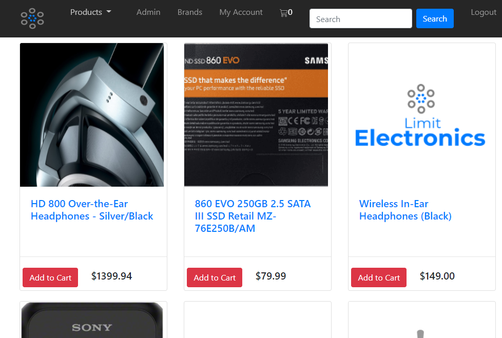

# Group Project 2: Limit Electronics
[](https://opensource.org/licenses/MPL-2.0)
## Description
This is as mock ecommerce site. Product data is stored in a MySQL database, and the users can browse in a variety of ways. They can see all of our products on one page, they can refine their search to a particular category or brand of product via a dropdown menu, and they can search for all products that partially match a string (e.g., "television").

Users can optionally create an account, and log in and log out. While logged in, they can view their member information.

Users can also products one at a time, and add any quantity of them to their shopping cart (which keeps persistant track of how many items have been added and displays the number in the navBar). When they are finished, they can go to their shopping cart, review the list of items, and click "checkout". This stores the transaction in an Orders table in our database. If they are logged in, the database also keeps track of which users order which product when.

If the user is granted administrative access, they will see an "Admin" button on the navBar. This button allows them to make changes to all products based on a specific key (e.g., the admin can get a list of all of the prices, and change them in a single interface) or they can access a particular product to change any or all of its values. They can also add a new product to the database from this screen. The administrator can also select "View or Manage Sales" to see a dynamic chart listing how many orders have been placed by day.

All pages are fully responsive, and should work just as well on mobile devices as on desktop machines.


## Table of Contents
* [Description](#Description)
* [Live URL](#Live%20URL)
* [Github Repo](#Github%20Repo)
* [Testing Instructions](#Testing%20Instructions)
* [Contribution Instructions](#How%20to%20Contribute)
* [Exciting Trivia](#Exciting%20Trivia)
* [Screenshot](#Screenshot)
* [License](#License)
* [Questions](#Questions)
## Installation Instructions
In the same directory as package.json, type ```npm install```. You will also need to set up a mySQL database, of course. The fully test the functionality, you will need to create a new user account (navigate to "/signup" in your browser). You will also need an admin account. For our heroku installation, please use the account ```"admin"``` with the password ``"god"``.
## Live URL
https://fierce-earth-38835.herokuapp.com/
## Github Repo
https://oroth8.github.io/Project2/
## How to Contribute
No contributions are being accepted at this time.
## Screenshot

## License
License: MPL 2.0


